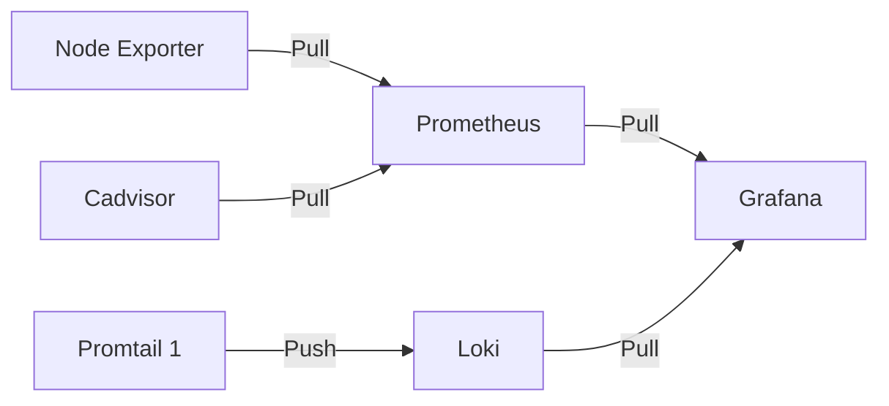

# System Monitor
prometheus-grafana-loki-promtail stack example

## Service Diagram

## Service summary

### Grafana
A visualizer tool. Collects data from `Loki`, `Prometheus`. It uses `promQL` to query prometheus & `logQL` to query loki.

### Prometheus
Collects metrics from `Node Exporter`, `Cadvisor` etc and stores in it's database. It expects a `/metrics` endpoint(default). 
- See list of exportes [here](https://prometheus.io/docs/instrumenting/exporters/)
- See list of client libraries [here](https://prometheus.io/docs/instrumenting/clientlibs/)

### Node Exporter
It's a exporter of prometheus. It collects system metrics and exposes an `/metrics` endpoint.

### Cadvisor
It's a exporter of prometheus. It collects docker metrics and exposes an `/metrics` endpoint.

### Loki
Collects logs from `promtail` and store them in it's database.

### Promtail
A logging agent. It collects logs from system and push them to `Loki`.

