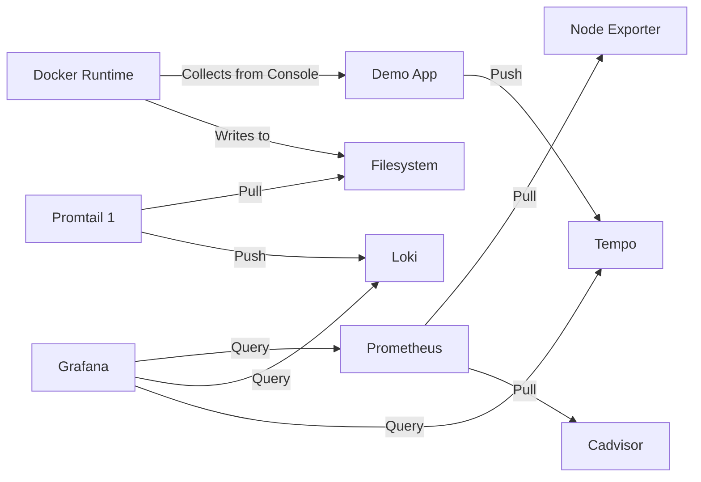

# System Monitor
prometheus-grafana-loki-promtail-tempo stack example in Docker

## Service Diagram

```mermaid
graph LR;

APP[Demo App]
DK[Docker Runtime]
G[Grafana]
L[Loki]
P1[Promtail 1]
PR[Prometheus]
NE[Node Exporter]
CD[Cadvisor]
T[Tempo]


DK-->|Collects from Console|APP
DK-->|Writes to|Filesystem
APP-->|Push|T
P1-->|Pull|Filesystem

PR-->|Pull|NE
PR-->|Pull|CD

P1-->|Push|L

G-->|Query|PR
G-->|Query|L
G-->|Query|T

```
